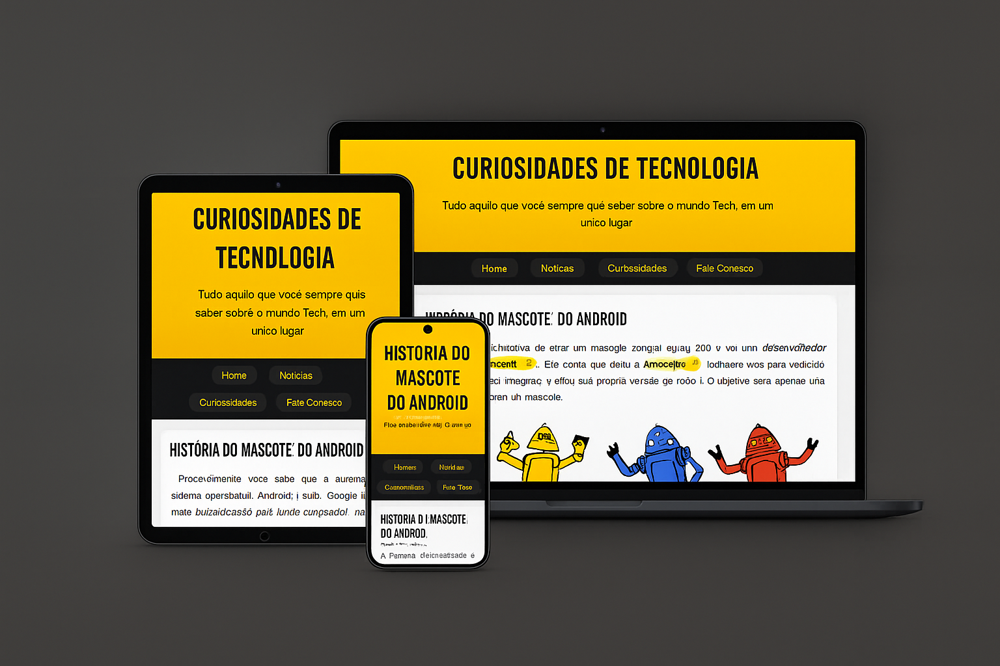

# 🤖 História do Android


## 🎨 Preview do Projeto

<div align="center">



_Interface moderna e responsiva em todos os dispositivos_

</div>

## 📱 Sobre o Projeto

Este projeto é um site educativo que conta a fascinante história do mascote do Android. Desenvolvido como parte do curso de HTML5 e CSS3, o site apresenta de forma interativa e responsiva a evolução do famoso robozinho verde, desde sua concepção até se tornar um dos símbolos mais reconhecidos do mundo tecnológico.

## 🎯 Objetivo

O principal objetivo deste site é compartilhar conhecimento sobre a história do Android de forma atraente e educativa, demonstrando como pequenas ideias podem se transformar em grandes símbolos da tecnologia mundial.

## 🛠️ Tecnologias Utilizadas

### HTML5

- Estrutura semântica (`header`, `nav`, `main`, `article`, `aside`, `footer`)
- Tags modernas para responsividade (`picture`, `source`)
- Elementos de mídia (`iframe` para vídeos)
- Links externos com atributos de segurança
- Abreviações (`abbr`) para melhor acessibilidade

### CSS3

- Variáveis CSS (Custom Properties) para:

  ```css
  --cor0: #ffffff;
  --cor1: #ffd700; /* Amarelo principal */
  --cor2: #ffb700; /* Amarelo mais escuro */
  --cor3: #1a1a1a; /* Preto suave */
  --cor4: #000000; /* Preto puro */
  --cor5: #333333; /* Cinza escuro */
  ```

- Fontes personalizadas:
  - Bebas Neue (Google Fonts)
  - Android (fonte local)
- Flexbox para layouts modernos
- Media Queries para responsividade
- Pseudo-elementos e pseudo-classes
- Gradientes e sombras
- Transições e efeitos hover

### Design Responsivo

- Adaptação para diferentes tamanhos de tela
- Imagens responsivas
- Layout fluido
- Mobile-first approach

## 📱 Recursos e Funcionalidades

- Menu de navegação intuitivo
- Artigo principal com história detalhada
- Imagens adaptativas para diferentes resoluções
- Vídeo incorporado do YouTube
- Seção "Quer aprender mais?" com informações extras
- Links externos para aprofundamento
- Design moderno e atraente
- Totalmente responsivo

## 🎨 Elementos de Design

- **Tipografia:**

  - Fonte personalizada Android para títulos especiais
  - Bebas Neue para destaques
  - Fontes do sistema para melhor legibilidade

- **Cores:**

  - Paleta em tons de verde
  - Gradientes suaves
  - Alto contraste para melhor leitura

- **Elementos Visuais:**
  - Imagens otimizadas
  - Ícones personalizados
  - Sombras e efeitos sutis

## 💻 Como Executar o Projeto

1. Clone este repositório:

```bash
git clone https://github.com/seu-usuario/projeto-android.git
```

2. Navegue até a pasta do projeto:

```bash
cd projeto-android
```

3. Abra o arquivo `index.html` em seu navegador preferido

## 📈 Performance e Otimização

- Imagens otimizadas em diferentes resoluções
- Código CSS organizado com variáveis
- Fontes alternativas configuradas
- Carregamento eficiente de recursos externos

## 🤝 Contribuição

Contribuições são bem-vindas! Se você encontrar algum bug ou tiver sugestões de melhorias:

1. Faça um Fork do projeto
2. Crie uma Branch para sua Feature (`git checkout -b feature/SuaFeature`)
3. Faça commit das suas alterações (`git commit -m 'Adiciona nova feature'`)
4. Faça Push para a Branch (`git push origin feature/SuaFeature`)
5. Abra um Pull Request

## 📄 Licença

Este projeto está sob a licença MIT. Veja o arquivo [LICENSE](LICENSE) para mais detalhes.

## 👨‍💻 Autor

Desenvolvido por [Seu Nome] como parte do curso de HTML5 e CSS3.

## 🙏 Agradecimentos

- Gustavo Guanabara e equipe do Curso em Vídeo
- Comunidade de desenvolvedores
- Google e Android pela inspiração e história

---

⌨️ com ❤️ por [Seu Nome]
